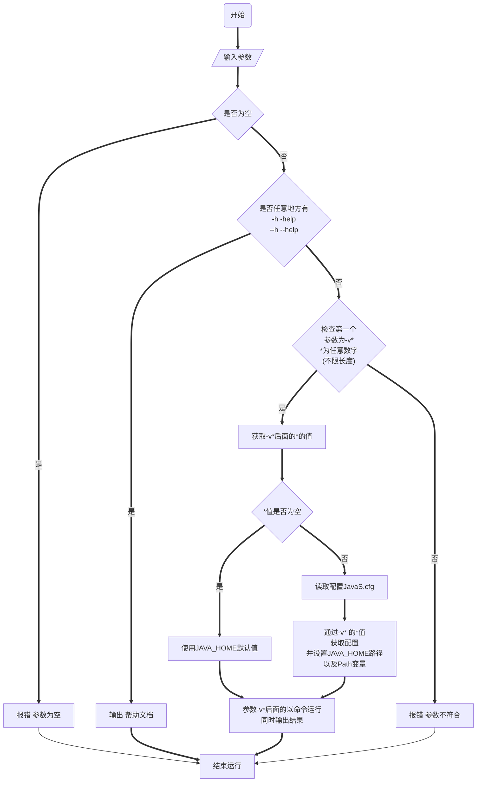

```mermaid
graph TD
    A("开始") ==> B[/"输入参数"/]
    B ==> C{"是否为空"}
    C =="是"==> D["报错 参数为空"]
    C =="否"==> E{是否任意地方有\n-h -help\n--h --help}
    E =="是"==> F["输出 帮助文档"]
    E =="否"==> G{"检查第一个\n参数为-v*\n*为任意数字\n(不限长度)"}
    G =="是"==> H["获取-v*后面的*的值"]
    G =="否"==> I["报错 参数不符合"]
    H ==> J{"*值是否为空"}
    J =="是"==> K[使用JAVA_HOME默认值]
    J =="否"==> M[读取配置JavaS.cfg]

    M ==> L[通过-v* 的*值\n获取配置\n并设置JAVA_HOME路径\n以及Path变量]
    L ==> N[参数-v*后面的以命令运行\n同时输出结果]

    N ==> O[结束运行]

    D --> O
    F ==> O
    I --> O
    K ==> N
```